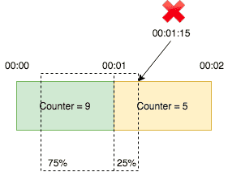

<h2>Anti-Abusing</h2>

배경

- 초 또는 분당 동일한 사용자의 동일한 수백번 이상의 요청을 비 정상접근(어뷰징)으로 판단
- 이로 인한 불필요한 로그와 트레이싱, 서버 부하 등 과도한 사용에 대해 서비스를 보호해주는 수단 
- 서비스의 가용성 확보를 위함 (API레벨, 네트워크 레벨, 컨테이너 레벨, CPU 레벨)
- 모든 웹 또는 API에서 호출하여 사용할 수 있도록 공용 API 개발 목적

개발

- Ratelimiter 알고리즘을 활용한 접근 제어 API 개발
    - 분당 일정 횟수(RequestsLimit) 이상의 동일한 요청을 동일한 사용자 기준으로 제어
    - 사용자 식별 값과 요청 url 등을 조합하여 유니크한 key를 생성하고 이를 활용하여 어뷰징 판단
    - HttpRequest 또는 사용자를 구분할 수 있는 식별 값을 포함한 DTO를 받아 처리
- 비 정상접근을 DB(couchbase)에 Log를 남기며 차단 기능, 비즈니스 분석 효율을 높임
- 블랙리스트, 화이트리스트 IP 및 UserAgent에 따른 접근 제어 기능
  - 웹 콘솔을 통해 RequestsLimit, BlackList, WhiteList, BlackUserAgent, WhiteUseragent, Keyword, notKeyword 제어 가능
- 요청 값은 큐를 통해 실시간으로 Anti-Abusing 서비스에 반영

기타

- 각 요청마다 해당 API를 사용해야 하기에 적절한 ConnectionTimeout 설정 (0.2s)
- NoSQL DB(Couchbase), 이벤트 큐 (RabbitMQ) 설치 필요

 

---
<h3>Sliding Window Counter</h3>

분당 10건 처리한다면 1분안에 9건의 요청이 오고 1분과 2분 사이에는 5건이 요청온다고 가정.
1분 15초에 요청이 왔는데 1분 15초 지점은 1분과 2분 사이에서 25% 지점, 이전 기간은 1 - 0.25 = 75% 비율로 계산해서 9 * 0.75 + 5 = 14.75 > 10으로 한도를 초과했기 때문에 요청은 거부된다. 즉, 이전 window와 현재 window의 비율값으로 계산된 합이 처리 건수를 초과하면 거부된다.
1분 30초 시점에 요청이 온다면 이전 기간은 50%, 9 * 0.5 + 5 = 9.5 < 10이므로 해당 요청은 처리된다.
 참고: https://medium.com/@avocadi/rate-limiter-sliding-window-counter-7ec08dbe21d6

---

<h4> Response Data </h4>

    "resultCode": "상태 코드",
    "resultMessage": "상태 메시지",
    "data": { 
        "block": "Block 대상 인지" ,
        "blockTime": "남아있는 Block된 시간",
        "message": "요청 처리 메시지",
        "currentRate": "1분간 요청 비율 (RequestsLimit > currentRate ? Pass : Block)",
        "currentRemainRequests": "남은 요청 수"
    }
}
---
현재 RequestsLimit은 5로 초기화된 상태  
 

1) 첫 요청의 경우 ( 1분 이전에 같은 요청이 없는 경우)
   1) 현재 정의해 둔 RequestsLimit(5) 이상을 1분동안 요청한 경우 Block 
   2) BlockTime이 0이 되기 전까지 block : true;
    
    
2) 이전 요청이 있는 경우 ( 1분 이전에 같은 요청이 있는 경우 )
   1) currentRate 비율과 RequestsLimit(5)을 비교하여 Block을 결정
   2) currentRate 비율은 1분 전 요청과 현재 요청을 현재 초를 기준으로 비율을 계산 
    
    
3) Rule ( BlackUserAgent에 Postman을 추가한 경우 )
   1) WhiteUserAgent, WhiteList(IP), Keyword: 로직을 타지 않고 PASS
   2) BlackUserAgent, BlackList(IP), notKeyWord: 로직을 타지 않고 Block
    

---
